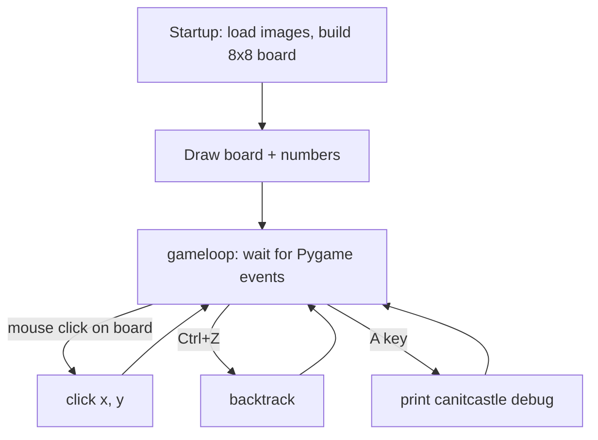
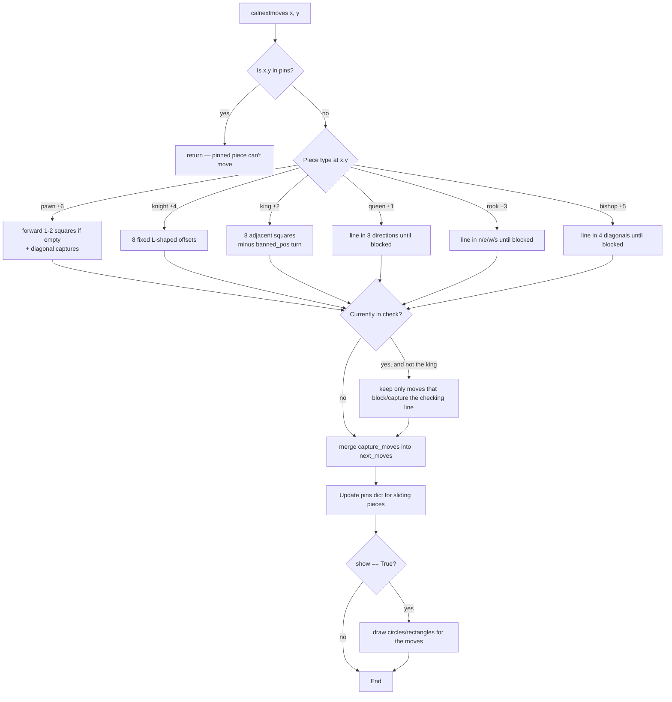
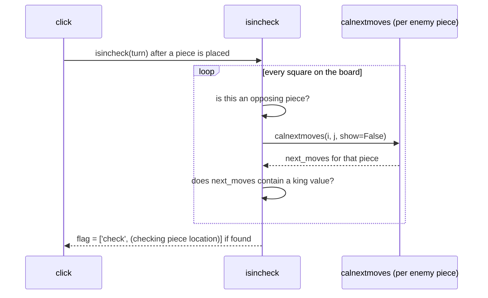
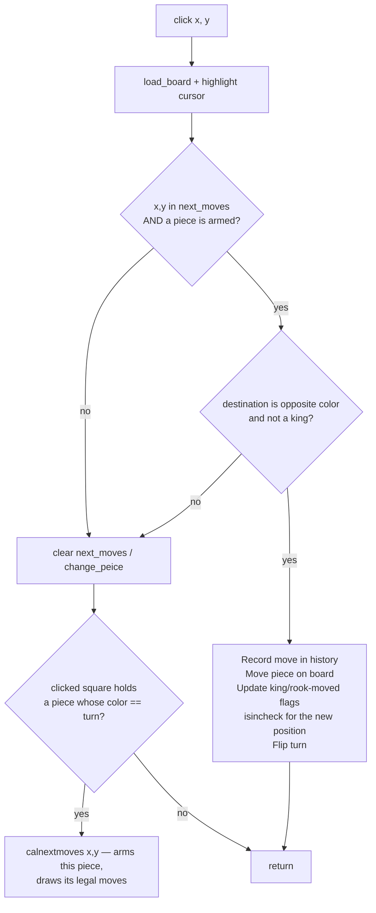

# `chess.py` — Developer Documentation

A single-file Pygame chess implementation. There are no classes — the board,
turn, selection state, check/pin state, and move history all live in
**module-level global variables** that the functions read and mutate
directly. This doc walks through the data model, the control flow, and each
function group, plus a list of quirks worth knowing before you touch this
file.

---

## 1. Mental model in one picture



Everything the user sees is driven by `gameloop()` dispatching Pygame events
to a small set of handlers. `click()` is the heart of the program: it is
called on *every* board click and has two jobs depending on what state the
game is in — **selecting a piece** and **moving a selected piece**.

---

## 2. Board representation

The board is an 8×8 list of lists (`board[row][col]`), row 0 = the black
back rank, row 7 = the white back rank. Each cell holds an integer:

| Value | Piece | Value | Piece |
|---|---|---|---|
| `0` | empty | | |
| `1` | black queen | `-1` | white queen |
| `2` | black king | `-2` | white king |
| `3` | black rook | `-3` | white rook |
| `4` | black knight | `-4` | white knight |
| `5` | black bishop | `-5` | white bishop |
| `6` | black pawn | `-6` | white pawn |

**Sign = color** (positive = black, negative = white). This is the single
most important convention in the file — almost every function uses
`tellsign(board[x][y])` to ask "whose piece is this?" rather than checking
the piece type.

```python
def tellsign(x): return (x > 0) - (x < 0)   # -1, 0, or +1
```

Coordinates are `(x, y)` = `(row, col)`, and note `click()` converts pixel
position to board cell as `(row, col) = ((y-offset)/cell, (x-offset)/cell)`
— screen-x maps to the column, screen-y maps to the row.

---

## 3. Global state variables

| Variable | Purpose |
|---|---|
| `board` | 8×8 piece grid (see above) |
| `turn` | `-1` or `1` — whose move it is (white starts, `turn = -1`) |
| `moves` | history stack for undo: each entry is `(piece, old_loc, new_loc[, captured_piece])` |
| `kingloc` | `[white_king_pos, black_king_pos, 'wnotmoved'/'wmoved', 'bnotmoved'/'bmoved']` |
| `isrookmoved` | 4 flags tracking whether each of the 4 rooks has moved (for castling eligibility) |
| `flag` | check status: `[]` if no check, else `['check', (row,col) of checking piece]` |
| `pins` | `{pinned_piece_loc: pinning_piece_loc}` — pieces that can't legally move |
| `next_moves` / `change_peice` | scratch state written by `calnextmoves()` and read by `click()` — effectively "what's currently selected and where can it go" |
| `debug` | tuple of function names; printing inside a function is gated on `'<name>' in debug` |

Because so much of this is global and mutated in place, reading any one
function in isolation can be misleading — e.g. `calnextmoves()` doesn't
*return* anything; it writes into the module-level `next_moves`.

---

## 4. Rendering functions

Simple, mostly self-contained:

- **`load_board()`** — redraws the board image, then blits every non-empty
  piece by looking up its sprite location via `peicelocsprite(val)`.
- **`numbers()`** — draws the 0–7 rank/file labels along the edges.
- **`highlight(x, y)` / `rectangle(x, y)` / `draw_circle(x, y)`** — cursor
  highlight, capture-target marker (square outline), and quiet-move marker
  (dot), respectively. `draw_circle` refuses to draw on an occupied square.

---

## 5. Move generation — `calnextmoves(x, y, show=True)`

This is the per-piece "what are my legal-ish moves" function. It dispatches
on the piece type at `(x, y)` and fills `next_moves` (quiet moves) and a
local `capture_moves` list, which gets folded into `next_moves` at the end.



Key building block: **`line(point, direc, ignore_peices=[0])`** walks one
step at a time in a direction string like `'ne'` (any combination of
n/s/e/w) until it falls off the board or hits a non-ignored piece,
returning every visited square. Queen/rook/bishop moves, `ispinning()`,
and `line_of_checks()` are all built on top of this one function.

**King moves** are special: they call `banned_pos(turn)` first, which
computes every square attacked by the opponent (by running
`calnextmoves` for each opposing piece with `show=False`) and subtracts
those from the king's candidate squares — this is what stops the king
from walking into check.

---

## 6. Check detection



`isincheck(turn)` scans the whole board for pieces of the opposite sign to
`turn`, generates their moves, and appends to `flag` if any of those moves
land on a king square. `line_of_checks()` then reconstructs the line
between the checking piece and the king (for sliding pieces) so that
`calnextmoves()` can restrict other pieces' moves to "block the check or
capture the checker."

**`banned_pos(turn)`** is a related but separate computation: it returns
the *set of squares* the king may not step onto (used only for king move
generation), whereas `isincheck` sets a flag once the check has already
happened.

---

## 7. Pins — `ispinning(peice_loc)`

For each sliding piece (queen/rook/bishop), `ispinning()` walks outward in
all 8 directions ignoring empty squares and the piece's own color, and asks:
"is there *exactly one* enemy piece between me and the enemy king on this
line?" If so, that enemy piece is pinned and gets recorded in the `pins`
dict as `{pinned_loc: pinning_piece_loc}`. `calnextmoves()` checks this
dict up front and refuses to generate any moves for a pinned piece.

Pins are re-validated (and removed) every time `calnextmoves()` runs, by
re-checking whether the pinning piece is still pinning.

---

## 8. Castling readiness — `canitcastle(kinglocation)`

Checks `kingloc` / `isrookmoved` flags and whether the squares between king
and rook are empty, returning `[left_ok, right_ok]`. **This function is
currently only ever called from the debug key handler (pressing `A`) and
its result is never used to actually move the rook** — there is no castling
*execution* path in `click()`. Treat it as a standalone eligibility check,
not a wired-up feature.

---

## 9. Click handling — the core state machine

`click(x, y)` is called on every board click and behaves differently
depending on whether a piece is already "armed" (i.e. `change_peice` was
set by a previous click):



So a normal turn is **two clicks**: click 1 selects a piece (arms
`change_peice` + shows `next_moves`), click 2 on a highlighted square
executes the move and flips `turn`. Clicking anywhere invalid just clears
the selection.

Note: pawn promotion is detected (`print('promotion case')`) but not
actually implemented — the pawn stays a pawn.

---

## 10. Undo — `backtrack()`

Pops the last entry off `moves` and reverses it: puts the moved piece back
at its old location, and either clears the destination (3-tuple entries) or
restores whatever piece was captured (4-tuple entries with
`eleminatedpval`). Bound to Ctrl+Z in `gameloop()`.

---

## 11. Main loop — `gameloop()`

Standard Pygame loop at 60 FPS: translates mouse clicks inside the board
area into `click(row, col)` calls, handles Ctrl+Z for undo, an `A` key
debug print for castling status, and quits on the window close event.

---

## 12. Things worth knowing before editing this file

- **Global mutable state everywhere.** `next_moves`, `change_peice`, `flag`,
  and `pins` are all read/written across function boundaries via `global`.
  Any new function touching move logic needs to know this shared state.
- **`initial()` looks unused.** `board` is already fully populated as a
  literal at module load time (lines ~50–57); `initial()` duplicates that
  setup by appending rows but is never called anywhere in the file. Likely
  dead code / leftover from an earlier version.
- **Castling is only half-built.** `canitcastle()` computes eligibility but
  nothing in `click()` moves the rook or the king two squares — there's no
  actual castling move available to the player yet.
- **Pawn promotion is a stub.** The condition is detected and printed but
  the piece value on the board is never changed.
- **`isincheck(turn)` is called with the mover's own `turn` value before it
  gets flipped** — worth tracing carefully if check detection ever looks
  like it's flagging the wrong side, since the "which king does this check
  apply to" logic depends on exactly when in `click()` this runs relative
  to the turn flip.
- **Hardcoded Windows-style paths** (`r'assets\chessboard1.png'`, etc.) will
  need `os.path.join` or forward slashes to run on macOS/Linux.
- **No `pg.quit()` on exit** — it's commented out in `gameloop()`.

---

## 13. Function reference (quick index)

| Function | Role |
|---|---|
| `numbers()` | draw rank/file labels |
| `initial()` | (dead code) alternate board setup |
| `peicelocsprite(val)` | sprite-sheet coordinates for a piece value |
| `printvars(**kwargs)` | debug printer |
| `load_board()` | draw board + all pieces |
| `highlight/rectangle/draw_circle` | selection & move markers |
| `tellsign(x)` | sign-of-x → color |
| `line(point, direc, ignore_peices)` | walk a direction until blocked |
| `banned_pos(turn)` | squares the king may not move to |
| `direction(point1, point2)` | compass direction between two squares |
| `line_of_checks(sign)` | squares between checker and king |
| `values(list_of_points)` | board values at a list of coordinates |
| `isincheck(turn)` | sets `flag` if a king is under attack |
| `ispinning(peice_loc)` | is this piece pinning an enemy piece to their king? |
| `canitcastle(kinglocation)` | castling eligibility (not executed) |
| `calnextmoves(x, y, show)` | legal-ish moves for the piece at (x, y) |
| `click(x, y)` | select / move state machine |
| `backtrack()` | undo last move |
| `gameloop()` | Pygame event loop |
